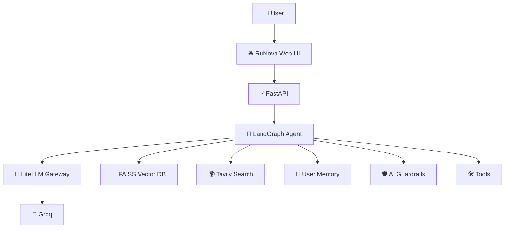
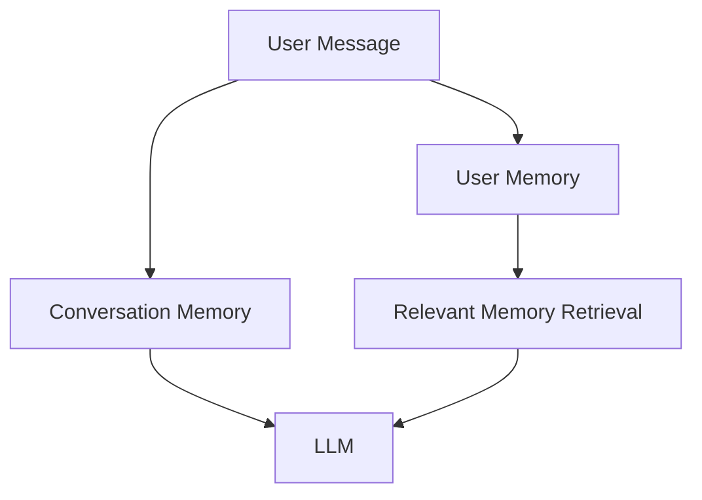

<!-- ========================================================= -->
<!--                       RuNova README                        -->
<!-- ========================================================= -->

<div align="center">


# 🚀 RuNova

### _An Intelligent Agentic AI Chatbot with RAG, Long-Term Memory, Web Search, Human-in-the-Loop, and AI Security_

<p align="center">


</p>

<p align="center">
<strong>
Document Intelligence • AI Memory • AI Security • Web Search • Human Approval • Modern UI
</strong>
</p>

</div>

---

# 🌟 Overview

RuNova is an **Agentic AI Chatbot** designed to go beyond traditional conversational assistants.

Unlike a basic chatbot, RuNova can:

- 📄 Understand uploaded documents
- 🌐 Search the internet in real time
- 🧠 Remember useful information about users
- 🔒 Protect itself using AI guardrails
- 🛠️ Use multiple intelligent tools
- 🤝 Ask for human approval before critical actions
- ⚡ Stream responses in real time

Built using **LangGraph**, **FastAPI**, **LiteLLM**, **FAISS**, **Groq**, and **LangChain**, RuNova provides an extensible architecture that can easily support multiple LLM providers.

---

# 🎯 Why RuNova?

Most AI chatbots only answer questions.

RuNova is designed to **reason, retrieve, remember, and safely interact** with users.

It combines multiple modern AI technologies into a single application:

- Agentic AI
- Retrieval-Augmented Generation (RAG)
- Long-Term Memory
- Human-in-the-Loop Workflows
- AI Security Guardrails
- Modern Authentication
- Multi-thread Conversations
- Streaming Responses

---

# ✨ Features

## 🤖 AI Chat

- Multi-turn conversations
- Streaming responses
- Thread-based chat history
- Automatic conversation titles
- Long-context conversations
- Intelligent context management

---

## 📄 Retrieval-Augmented Generation (RAG)

Upload documents and chat with them naturally.

Supported features include:

- Semantic Search
- FAISS Vector Database
- HuggingFace Embeddings
- Maximum Marginal Relevance (MMR)
- Optional Cross Encoder Re-ranking
- Source-aware Retrieval
- Hallucination Reduction

---

## 📁 Supported Documents

RuNova currently supports:

| Type | Supported |
|-------|-----------|
| 📕 PDF | ✅ |
| 📄 DOCX | ✅ |
| 📄 TXT | ✅ |
| 📊 CSV | ✅ |
| 📈 Excel | ✅ |
| 📑 PPT / PPTX | ✅ |
| 🌐 HTML | ✅ |
| 📝 Markdown | ✅ |
| 🖼 Images (OCR) | ✅ |

---

## 🌍 Live Web Search

When local documents don't contain the answer, RuNova can search the web using **Tavily Search** to provide up-to-date information.

---

## 🧮 Built-in AI Tools

RuNova includes multiple intelligent tools:

- 📄 Document Retrieval
- 🌐 Web Search
- ☀️ Weather
- 📈 Stock Information
- ➗ Calculator
- 🕒 Date & Time
- 🤝 Human Approval Workflow

---

# 🧠 AI Memory

RuNova contains **two independent memory systems**.

### 💬 Conversation Memory

- Rolling summaries
- Context preservation
- Reduced token usage
- Long conversation support

### 👤 User Memory

- Stores useful user facts
- Cross-thread persistence
- Relevant memory retrieval
- Memory deletion
- Memory management

---

# 🛡 AI Security

RuNova includes multiple AI security mechanisms.

### Input Security

- ✅ Prompt Injection Detection
- ✅ Harmful Prompt Filtering
- ✅ Input Validation
- ✅ Sensitive Data Detection

### Output Security

- ✅ PII Protection
- ✅ Hallucination Detection
- ✅ Output Validation
- ✅ Safe Response Generation

---

# ⚡ LiteLLM Gateway

Every LLM request passes through a centralized gateway.

Features include:

- Automatic Retry
- Model Fallback
- Cost Tracking
- Latency Monitoring
- Local Caching
- Usage Reporting
- Model Routing
- Provider Abstraction

---

# 🔐 Authentication

RuNova supports secure authentication using:

- Google OAuth
- JWT Sessions
- User Isolation
- Protected APIs

---

# 🏗 Architecture



---

# 🛠 Tech Stack

| Category | Technology |
|-----------|------------|
| 🐍 Language | Python |
| 🌐 Backend | FastAPI |
| 🤖 AI Framework | LangGraph |
| 🔗 LLM Framework | LangChain |
| 🚪 Gateway | LiteLLM |
| 🧠 Embeddings | HuggingFace |
| 📄 Vector Database | FAISS |
| 🌍 Search | Tavily |
| 💾 Database | SQLite |
| 🔑 Authentication | Google OAuth + JWT |
| 🎨 Frontend | HTML, CSS, JavaScript |
| 🤖 Models | Groq (Default), LiteLLM Compatible |

---

# 📂 Project Structure

```text
RuNova/
│
├── api.py                 # FastAPI server and API routes
├── backend.py             # LangGraph chatbot backend
├── gateway.py             # LiteLLM Gateway
├── auth.py                # Google OAuth & JWT authentication
├── runova.html            # Frontend UI
├── requirements.txt
├── chatbot.db             # SQLite database
├── faiss_db/              # Vector databases
├── uploads/               # Uploaded documents (optional)
├── .env
└── README.md
```

---

# 🚀 Quick Start

## 1️⃣ Clone the Repository

```bash
git clone https://github.com/yourusername/RuNova.git

cd RuNova
```

---

## 2️⃣ Create a Virtual Environment

### Windows

```bash
python -m venv .venv

.venv\Scripts\activate
```

### Linux / macOS

```bash
python3 -m venv .venv

source .venv/bin/activate
```

---

## 3️⃣ Install Dependencies

```bash
pip install -r requirements.txt
```

---

# ⚙️ Environment Variables

Create a file named **`.env`** in the project root.

```env
# ===========================================
# LLM Providers
# ===========================================

GROQ_API_KEY=

HF_TOKEN=

# ===========================================
# Search APIs
# ===========================================

TAVILY_API_KEY=

# ===========================================
# Weather API
# ===========================================

OPENWEATHER_API_KEY=

# ===========================================
# Stock API
# ===========================================

ALPHAVANTAGE_API_KEY=

# ===========================================
# Authentication
# ===========================================

GOOGLE_CLIENT_ID=

SESSION_SECRET=
(for SESSION_SECRET, you can generate a random string by running this command in your terminal: `python -c "import secrets; print(secrets.token_urlsafe(32))"`)
```

---

# 🤖 Multiple LLM Provider Support

RuNova is built using **LiteLLM**, making it easy to switch between different LLM providers.

> **Note:**  
> The current project is configured to use **Groq models by default**, but thanks to LiteLLM you can easily switch to any supported provider without changing the chatbot architecture.

---

# 🔄 How to Change the LLM Provider

Switching providers only requires **two simple steps**.

## Step 1

Add the API key for your preferred provider inside `.env`.

Example:

```env
OPENAI_API_KEY=your_key_here
```

or

```env
ANTHROPIC_API_KEY=your_key_here
```

or

```env
GEMINI_API_KEY=your_key_here
```

---

## Step 2

Open **gateway.py**

Locate the `MODEL_TIERS` dictionary.

Example:

```python
MODEL_TIERS = {
    "balanced": [
        "groq/llama-3.3-70b-versatile",
        "groq/openai/gpt-oss-120b",
    ]
}
```

Simply replace the model names.

### Example (OpenAI)

```python
MODEL_TIERS = {
    "balanced": [
        "openai/gpt-4.1",
        "openai/gpt-4o-mini",
    ]
}
```

---

### Example (Anthropic)

```python
MODEL_TIERS = {
    "balanced": [
        "anthropic/claude-sonnet-4",
        "anthropic/claude-3-5-haiku",
    ]
}
```

---

### Example (Gemini)

```python
MODEL_TIERS = {
    "balanced": [
        "gemini/gemini-2.5-pro",
        "gemini/gemini-2.5-flash",
    ]
}
```

---

### Example (OpenRouter)

```python
MODEL_TIERS = {
    "balanced": [
        "openrouter/deepseek/deepseek-chat-v3",
        "openrouter/meta-llama/llama-3.3-70b-instruct",
    ]
}
```

---

### Example (Ollama)

```python
MODEL_TIERS = {
    "balanced": [
        "ollama/llama3.2",
        "ollama/qwen3",
    ]
}
```

Restart the application after updating the model names.

---

# 📄 Supported Documents

RuNova supports Retrieval-Augmented Generation (RAG) over a variety of document formats.

| Format | Support |
|----------|---------|
| PDF | ✅ |
| DOCX | ✅ |
| TXT | ✅ |
| CSV | ✅ |
| XLSX | ✅ |
| XLS | ✅ |
| PPT | ✅ |
| PPTX | ✅ |
| Markdown | ✅ |
| HTML | ✅ |
| PNG | ✅ (OCR) |
| JPG | ✅ (OCR) |
| JPEG | ✅ (OCR) |
| WEBP | ✅ (OCR) |
| BMP | ✅ (OCR) |
| TIFF | ✅ (OCR) |

---

# 🧠 Retrieval Pipeline

The RAG pipeline follows these steps:

```text
Document Upload
        │
        ▼
Document Loader
        │
        ▼
Text Chunking
        │
        ▼
Embeddings Generation
        │
        ▼
FAISS Vector Database
        │
        ▼
Semantic Retrieval
        │
        ▼
MMR Ranking
        │
        ▼
Cross Encoder Re-ranking (Optional)
        │
        ▼
LLM Response
```

---

# ▶️ Running RuNova

Start the FastAPI server.

```
python -m uvicorn api:app --reload
```

The application will be available at:

```
http://127.0.0.1:8000
```

---

# 📷 User Interface

RuNova includes a modern responsive web interface featuring:

- 🔐 Google Sign-In
- 💬 Real-time AI chat
- 📄 Document upload
- 🧠 Memory panel
- 🌐 Web search mode
- 🛠 Tool execution
- ⚡ Streaming responses
- 📚 Chat history
- 🌙 Modern responsive design

> **Tip:** Add screenshots of the login page, main chat interface, and document upload flow here to make your repository more engaging.

---

# 💡 Example Questions

You can ask RuNova questions like:

```text
Summarize the uploaded PDF.
```

```text
What are the key findings in this research paper?
```

```text
Search the latest AI news.
```

```text
What's the weather in New York?
```

```text
Calculate (125 * 89) / 7.
```

```text
Remember that my favorite programming language is Python.
```

```text
What do you remember about me?
```

---

# 🛡 AI Security

Security is a core part of RuNova's architecture rather than an afterthought.

## 🔐 Input Guardrails

Before every request reaches the LLM, RuNova performs multiple validation checks.

- 🛡 Prompt Injection Detection
- 🚫 Harmful Prompt Filtering
- 🔍 Input Validation
- 🔒 Sensitive Information Detection
- 📏 Input Sanitization

---

## 🔐 Output Guardrails

Every AI response is validated before being shown to the user.

- 🔍 Hallucination Detection
- 🔒 Personally Identifiable Information (PII) Protection
- ✅ Output Validation
- 📝 Safe Response Generation

---

# 🧠 Memory Architecture

RuNova uses a dual-memory system.



### 💬 Conversation Memory

Maintains context throughout long conversations by automatically generating rolling summaries, reducing token usage while preserving important information.

### 👤 User Memory

Stores meaningful user-specific facts that persist across conversations, allowing RuNova to personalize future interactions.

Examples:

- Favorite programming language
- Preferred learning style
- Career goals
- Frequently used technologies

---

# ⚙ LiteLLM Gateway

Every model request is routed through **gateway.py**.

The gateway provides:

- 🔄 Automatic retries
- 🔀 Model fallbacks
- 📊 Cost tracking
- ⏱ Latency monitoring
- 💾 Response caching
- 📈 Usage reporting
- 🛡 Guardrail integration

---

# 🚀 Performance Features

- ⚡ Streaming Responses
- 📄 Semantic Document Retrieval
- 🔍 MMR Search
- 🧠 HuggingFace Embeddings
- 💾 FAISS Vector Database
- 📈 Optional Cross-Encoder Re-ranking
- 🔄 Automatic Retry Logic
- 🚪 LiteLLM Gateway
- 📊 Cost Monitoring

---

# 🎯 Use Cases

RuNova can be used for:

- 📚 Research Assistant
- 🎓 Student Learning
- 📄 PDF Question Answering
- 🏢 Enterprise Knowledge Base
- 📖 Technical Documentation Search
- 🤖 AI Copilot
- 💼 Productivity Assistant
- 🔍 Information Retrieval
- 🌍 Real-Time Search
- 🧠 Personal AI Assistant

---

# 🤝 Human-in-the-Loop (HITL)

Certain actions require user confirmation before execution.

This ensures that sensitive or important operations are only performed after explicit approval, improving safety and user control.

---

# 📈 Future Roadmap

## Completed

- ✅ Agentic AI Chatbot
- ✅ Document RAG
- ✅ FAISS Vector Database
- ✅ Web Search
- ✅ User Memory
- ✅ Conversation Memory
- ✅ Google OAuth
- ✅ JWT Authentication
- ✅ AI Guardrails
- ✅ LiteLLM Gateway
- ✅ Streaming Responses
- ✅ Human-in-the-Loop
- ✅ OCR Support
- ✅ RAGAS Evaluation

---

## Planned

- ⬜ Voice Conversations
- ⬜ Image Understanding
- ⬜ Image Generation
- ⬜ Multi-Agent Collaboration
- ⬜ Docker Deployment
- ⬜ Kubernetes Deployment
- ⬜ Cloud Vector Databases
- ⬜ MCP Integration
- ⬜ Mobile Application

---

# 🤝 Contributing

Contributions are welcome!

If you'd like to improve RuNova:

1. Fork the repository
2. Create a feature branch

```bash
git checkout -b feature/my-feature
```

3. Commit your changes

```bash
git commit -m "Add my feature"
```

4. Push the branch

```bash
git push origin feature/my-feature
```

5. Open a Pull Request

---

# 📝 License

This project is licensed under the **MIT License**.

You are free to:

- ✅ Use
- ✅ Modify
- ✅ Distribute
- ✅ Build upon

See the **LICENSE** file for details.

---

# 🙏 Acknowledgements

RuNova is built using several outstanding open-source projects.

Special thanks to:

- 🦜 LangChain
- 🕸 LangGraph
- 🚪 LiteLLM
- 🤖 Groq
- 🤗 HuggingFace
- 📄 FAISS
- 🔍 Tavily
- ⚡ FastAPI

---

# ⭐ Support the Project

If you found RuNova useful, please consider giving the repository a ⭐ on GitHub.

It helps others discover the project and motivates future development.

---

<div align="center">

## 🚀 RuNova

### Intelligent • Secure • Extensible

**Built with ❤️ using LangGraph, LiteLLM, FastAPI, and modern AI technologies.**

⭐ **If you like this project, don't forget to star the repository!**

</div>

